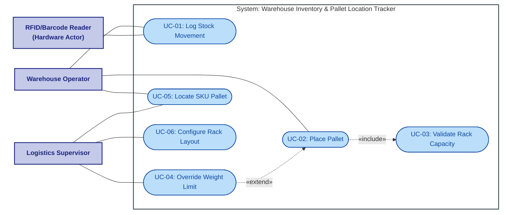

# Lab 1: Requirements Engineering & UML Use-Case Modelling

## Problem Statement #27: Warehouse Inventory & Pallet Location Tracker
**Domain:** Smart Cities, Transport & Logistics  
**Objective:** Elicit key functions and constraints, write clear and testable functional (FR) and non-functional (NFR) requirements, construct a UML use-case diagram with stick figures, and draft a use-case specification.

---

## Deliverables in this Directory
- 🗺️ **UML Use-Case Diagram**: [use_case_diagram.pdf](use_case_diagram.pdf) (Vector PDF with stick-figure actors)
- 📊 **Requirements Table**: Detailed inline under [Section 1](#1-requirements-specification-table)
- 📝 **Use-Case Flow Document**: Detailed inline under [Section 2](#2-use-case-flow-document-place-pallet-uc-02)

---

## 1. Requirements Specification Table

| Req ID | Type | Description | Priority | Acceptance Criteria | Rationale |
| :--- | :--- | :--- | :--- | :--- | :--- |
| **FR-001** | Functional | The system shall validate proposed pallet placement coordinates against the rack maximum load capacity before confirming storage. | High | **Pass:** Pallet assigned to valid rack; **Fail:** Placement permitted on rack where total weight exceeds rated structural limit. | Ensures physical safety of the warehouse by preventing rack collapses due to overload. |
| **FR-002** | Functional | The system shall log stock movements automatically when a barcode or RFID tag is scanned by a Warehouse Operator. | High | **Pass:** System records timestamp, SKU, operator ID, and origin/destination coordinates upon successful scan; **Fail:** Scan does not register or logs incomplete details. | Enables real-time tracking of inventory movements and maintains stock accuracy. |
| **FR-003** | Functional | The system shall allow a Logistics Supervisor to configure and modify the 3D coordinate layout and maximum weight capacity of warehouse racks. | Medium | **Pass:** Updated weight limits are immediately applied to pallet validation logic; **Fail:** Non-supervisors can modify limits, or updates fail to reflect in validations. | Allows the supervisor to adapt the storage layout based on structural changes or product specifications. |
| **FR-004** | Functional | The system shall provide a search interface that allows operators to look up the 3D coordinates (zone, aisle, shelf, position) of a pallet using its SKU code. | High | **Pass:** Search returns exact 3D coordinates for active SKUs and returns 'SKU not found' for invalid ones; **Fail:** System returns incorrect coordinates or fails to find existing SKUs. | Critical for operators to quickly locate items for picking, reducing retrieval times. |
| **FR-005** | Functional | The system shall automatically trigger an alert notification to the Logistics Supervisor if a barcode/RFID scan detects an item placed in an incorrect rack position. | Medium | **Pass:** Alert is generated and displayed on the supervisor's dashboard within 5 seconds of the misplacement; **Fail:** Misplacement occurs without triggering an alert. | Prevents inventory inaccuracies and ensures misplaced items are resolved immediately. |
| **NFR-001** | Non-Functional (Performance & Security) | The warehouse item lookup service must locate any SKU pallet coordinate across 100,000 bins in under 100 ms. | High | **Pass:** Benchmarking tests confirm target latency of < 100 ms under simulated peak load of 1,000 concurrent requests; **Fail:** Average search lookup response time exceeds 100 ms. | Ensures warehouse operations are not delayed by slow system responses. |
| **NFR-002** | Non-Functional (Availability) | The warehouse inventory tracking system shall maintain 99.9% uptime during operational hours (6:00 AM to 10:00 PM). | High | **Pass:** System monthly downtime during operational hours is less than 30 minutes; **Fail:** System is unavailable for more than 30 minutes in a month. | High availability is required to prevent halting warehouse loading/unloading operations. |

---

## 2. Use-Case Flow Document: Place Pallet (UC-02)

### **Preconditions**
1. The Warehouse Operator is logged into the system.
2. The pallet is loaded onto a forklift/pallet jack.
3. The target rack and coordinates are defined and empty.

### **Postconditions**
1. The pallet is successfully placed at the 3D coordinates.
2. The system updates the rack's current weight.
3. The stock location is updated in the database.

### **Main Success Scenario**
1. Operator scans the barcode/RFID tag on the pallet.
2. System retrieves SKU and weight of the pallet from the inventory database and displays them.
3. Operator scans the location barcode on the shelf slot.
4. System validates the proposed 3D coordinates against the rack's maximum load capacity.
5. System confirms the location is valid and displays a "Placement Approved" message.
6. Operator places the pallet in the slot and confirms the placement on their handheld terminal.
7. System logs the stock movement and updates the inventory location and rack weight.

### **Alternate Flow (8a. Overweight / Capacity Validation Failed)**
- **4a.** System detects that the proposed pallet weight exceeds the rack's maximum load capacity.
- **4b.** System displays an "Overweight Alert" and blocks the placement.
- **4c.** Operator can either:
  - Choose a different rack slot (re-initiates step 3).
  - Request a Logistics Supervisor override (initiates UC-04: Override Weight Limit). If approved, placement proceeds to step 5.
  - Cancel the operation (operation terminates, pallet remains in original state).

---

## 3. UML Use-Case Diagram Details

Below is the interactive Mermaid rendering of the UML Use-Case diagram. This diagram renders natively inside GitHub's interface:

### Diagram Components
- **Actors**:
  - **Warehouse Operator** (Primary Actor) - Performs scanning and physical pallet placement.
  - **Logistics Supervisor** (Primary Actor) - Enforces capacity layouts and handles validation overrides.
  - **RFID/Barcode Reader** (Supporting System/Hardware Actor) - Automatically feeds scan inputs to the system.
- **Relationships**:
  - **«include»**: `UC-02: Place Pallet` includes `UC-03: Validate Rack Capacity` (always checking structural limits).
  - **«extend»**: `UC-04: Override Weight Limit` optionally extends `UC-02: Place Pallet` if a capacity check fails and the operator requests supervisor authorization.
