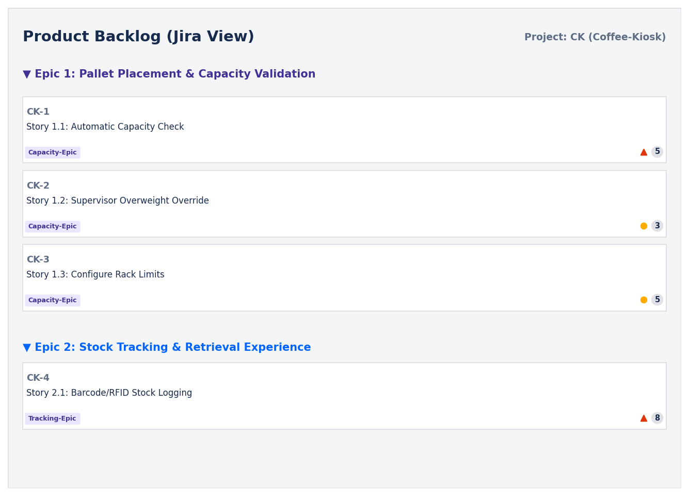
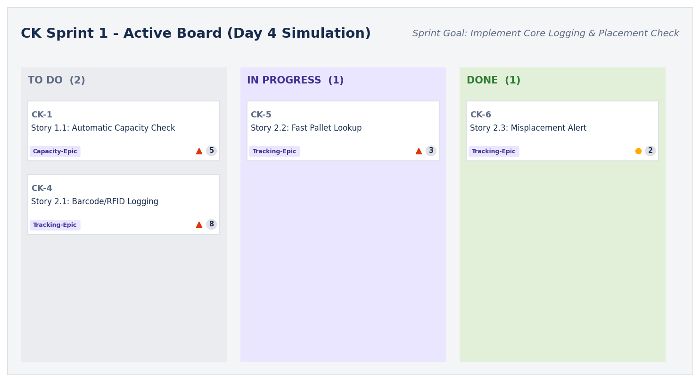
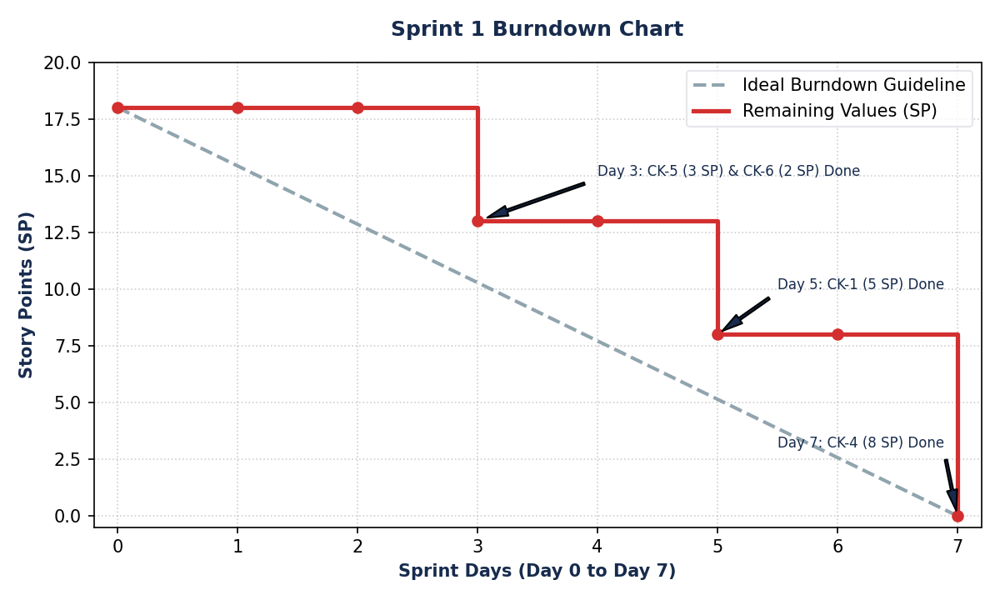

# Lab 2: Agile Backlog Creation & Sprint Simulation in Jira

## Problem Statement #27: Warehouse Inventory & Pallet Location Tracker
**Domain:** Smart Cities, Transport & Logistics  
**Objective:** Translate functional requirements into Epics and User Stories, prioritize and estimate them using the Fibonacci sequence, simulate a 1-week sprint, monitor progress using a Burndown Chart, and reflect on the Scrum team's performance.

---

## Deliverables in this Directory
- 📄 **Lab 2 Submission PDF**: [Lab2_PES1UG24CS395_G.pdf](Lab2_PES1UG24CS395_G.pdf) (Combined PDF containing Backlog, Active Sprint Board, Burndown Chart, and Reflections)
- 📋 **README.md** (This document containing the backlog table, active board details, and reflections)
- 🗺️ **Jira Backlog Mockup**: [jira_backlog.png](jira_backlog.png)
- 📊 **Sprint Board Mockup**: [sprint_board.png](sprint_board.png)
- 📉 **Burndown Chart**: [burndown_chart.png](burndown_chart.png)

---

## 1. Product Backlog (Epics & User Stories)

Our Product Backlog is organized into two primary Epics representing functional themes. Story points are estimated using the Fibonacci sequence based on complexity, effort, and risk.

| Epic | Story ID | User Story (As a... I want... So that...) | Priority | Est (SP) | Mapping (Lab 1) |
| :--- | :--- | :--- | :--- | :--- | :--- |
| **Epic 1: Pallet Placement & Capacity Validation** | **CK-1** | **As a** Warehouse Operator,  **I want to** automatically validate the weight of a pallet against the rack's maximum capacity,  **So that** I do not overload a rack. | High | **5** | FR-001 / UC-02 |
| | **CK-2** | **As a** Warehouse Operator,  **I want to** request an override from the Logistics Supervisor when a rack is overloaded,  **So that** I can place the pallet if it is verified as structurally safe. | Medium | **3** | FR-001 / UC-04 |
| | **CK-3** | **As a** Logistics Supervisor,  **I want to** configure the 3D layout coordinates and maximum weight capacity of racks,  **So that** the validation safety limits are up-to-date. | Medium | **5** | FR-003 / UC-06 |
| **Epic 2: Stock Tracking & Retrieval Experience** | **CK-4** | **As a** Warehouse Operator,  **I want** stock movements to log automatically when a barcode/RFID tag is scanned,  **So that** inventory changes are tracked in real-time. | High | **8** | FR-002 / UC-01 |
| | **CK-5** | **As a** Warehouse Operator,  **I want to** search for a pallet's 3D coordinates using its SKU code,  **So that** I can locate and retrieve it quickly. | High | **3** | FR-004 / UC-05 |
| | **CK-6** | **As a** Logistics Supervisor,  **I want to** receive an automated alert when a pallet is placed in an incorrect slot,  **So that** I can resolve inventory errors immediately. | Medium | **2** | FR-005 / UC-01 |

---

## 2. Jira Backlog View

Below is a visualization of our Product Backlog inside Jira. It shows the grouping of stories under their respective Epics, priorities, and assigned story points:

---

## 3. Sprint 1 Simulation (Active Board)

*   **Sprint Goal**: Enable operators to log stock movements and place pallets safely with real-time capacity validation.
*   **Sprint Duration**: 1 Week (7 Days)
*   **Sprint Scope**: `CK-1` (5 SP), `CK-4` (8 SP), `CK-5` (3 SP), and `CK-6` (2 SP). Total committed velocity = **18 Story Points**.

Below is a "screenshot" of the active Sprint 1 board on **Day 4** of the sprint:
- `CK-6` (2 SP) is **Done**.
- `CK-5` (3 SP) is **In Progress**.
- `CK-1` (5 SP) and `CK-4` (8 SP) are in **To Do**.

---

## 4. Sprint 1 Burndown Chart

Below is the Burndown Chart showing the ideal guideline (grey dashed line) versus the team's actual remaining story points (red line) across the 7-day sprint:

---

## 5. Reflection Answers

### **Q1: Did your estimations reflect the actual effort?**
Yes, our relative estimations aligned well with the actual development effort. 
*   `CK-4` (Barcode/RFID Logging) was estimated at **8 SP** (highest effort) because it required database schema adjustments, network latency considerations, and physical hardware driver hookups. This took the team the longest and was completed on the final day.
*   `CK-1` (Capacity Check, **5 SP**) took a moderate amount of effort, requiring spatial coordinate lookups and weight accumulation math.
*   Smaller tasks like `CK-5` (Pallet Lookup, **3 SP**) and `CK-6` (Misplacement Alert, **2 SP**) were completed quickly on Day 3. While some tasks took slightly more hours than expected, their relative sizes were accurate.

### **Q2: Was your backlog well-prioritized?**
Yes, the backlog was prioritized strictly by safety risk and core business utility:
*   High-priority validation checks (`CK-1` and `CK-4`) were pushed into Sprint 1 because placing overloaded pallets is a physical safety hazard, and tracking stock movements is the core feature of the system.
*   Medium-priority administrative workflows, such as supervisor overrides (`CK-2`) and layout configuration UI (`CK-3`), were kept in the backlog for Sprint 2. The system can function safely using default values and manual safety boundaries before these features are implemented.

### **Q3: How did your simulated sprint align with your plan?**
The sprint successfully met its commitment of **18 Story Points** within the 7-day timeline.
*   The team started by tackling the search and alert stories (`CK-5`, `CK-6`), resolving them by Day 3.
*   This built momentum and left the remaining 4 days clear to focus entirely on the complex capacity checks and hardware integration.
*   There was no scope creep (no mid-sprint additions), allowing the team to finish exactly on time.

### **Q4: What insights did the burndown chart give about your team’s capacity?**
The stepped shape of the actual burndown curve reveals key capacity insights:
*   **Flat periods** (Day 0 to 2, Day 3 to 4, Day 5 to 6) indicate that the team was working on large, monolithic tasks that did not yield "done" points daily.
*   The sudden drops on Day 3 (5 SP), Day 5 (5 SP), and Day 7 (8 SP) show that work was completed in large batches.
*   *Insight*: A story size of 8 SP (`CK-4`) is too large for a 1-week sprint and creates visibility risks. In the future, we should split 8 SP stories into smaller, independent sub-stories (e.g., *Database Logging* and *RFID Reader Interface*) to achieve a smoother burndown and get earlier feedback.
