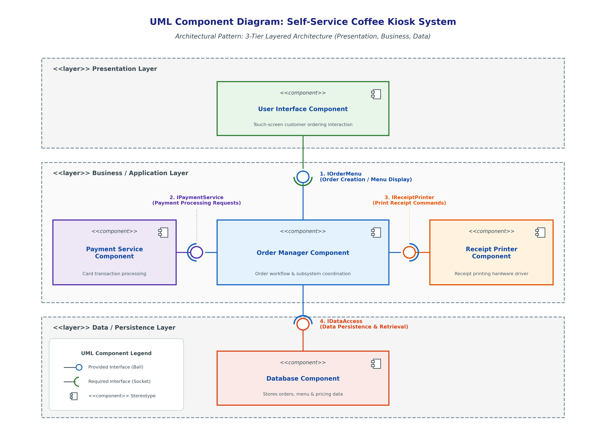
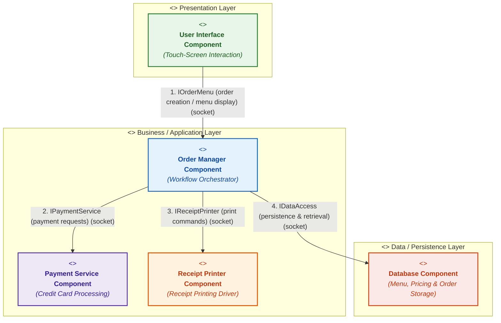

# Lab 3: Component Modelling & Architectural Pattern Selection

**Student Name:** Saatvik Gupta  
**SRN:** PES1UG24CS395  
**Section:** G  
**Course:** Software Engineering Laboratory  
**Scenario:** Self-Service Coffee Kiosk System  

---

## Deliverables Summary
* 📄 **Lab 3 Submission PDF**: [Lab3_PES1UG24CS395_G.pdf](Lab3_PES1UG24CS395_G.pdf) (Complete formatted report with 1-page justification, tables, and checklist)
* 🗺️ **UML Component Diagram (High-Res PNG)**: [component_diagram.png](component_diagram.png)
* 📐 **UML Component Diagram (Vector PDF)**: [component_diagram.pdf](component_diagram.pdf)
* 📝 **Inline Specification**: Detailed below in this README with native Mermaid diagram and tables

---

## 1. Scenario Overview & Problem Context

The **Self-Service Coffee Kiosk System** is deployed on dedicated hardware in a busy café environment. It provides an automated, unattended ordering and payment experience for customers.

### Core Functional Requirements
* **Coffee Selection**: Customer selects from 3 coffee types (**Espresso**, **Americano**, or **Latte**).
* **Size Selection**: Customer chooses from 2 drink sizes (**Small** or **Large**).
* **Payment Processing**: Payment is accepted exclusively via **Credit Card** (EMV chip / contactless NFC).
* **Receipt Generation**: Physical itemized receipt printed via an integrated hardware thermal receipt printer.
* **Hardware Interfacing**: Touch-screen display for customer interaction, card reader terminal, and receipt printer.
* **Data Management**: Persistent storage of drink catalog, sizing options, dynamic pricing matrices, and completed transaction audit logs.

### Non-Functional Constraints & Quality Attributes
* **Performance (SLA)**: Complete customer ordering and payment lifecycle in **under 60 seconds** to avoid queue congestion.
* **Usability**: Responsive, intuitive touch-screen navigation with clear visual feedback.
* **Security & Compliance**: Strict isolation of sensitive payment data adhering to **PCI-DSS** standards; zero raw cardholder data persisted locally.
* **Reliability**: Fault-tolerant execution capable of completing sales even during transient network or cloud connectivity drops.

---

## 2. One-Page Written Architectural Justification

### Architecture Selection
> **"We chose Layered Architecture (3-Tier Layered Pattern) for the Self-Service Coffee Kiosk System."**

The system is organized into three distinct horizontal tiers:
1. **Presentation Layer**: Customer-facing touch-screen interface (`User Interface Component`).
2. **Business / Application Layer**: Domain workflow, payment processing, and hardware coordination (`Order Manager Component`, `Payment Service Component`, `Receipt Printer Component`).
3. **Data / Persistence Layer**: Local data storage for menu, pricing, and orders (`Database Component`).

---

### Two Scenario-Related Reasons for Selection

1. **Natural Mapping to Physical Kiosk Hardware/Software Boundaries**:  
   A self-service kiosk integrates heterogeneous hardware devices—a touch-screen display, an EMV/NFC credit card reader, and a thermal receipt printer. The Layered Architecture cleanly decouples device-specific hardware drivers from domain business logic. The `User Interface Component` in the Presentation Layer captures gestures and selections without knowledge of how recipes or transactions are calculated. The `Receipt Printer Component` and `Payment Service Component` in the Business Layer wrap hardware drivers behind standardized interfaces. This modularity allows the café to swap receipt printer models or upgrade the card terminal without modifying or re-testing core ordering workflows.

2. **Monolithic In-Process Reliability for Dedicated Edge Terminals**:  
   Unlike a distributed microservices architecture that requires container virtualization, service registries, and network serialization, a layered architecture executes as a single, in-process runtime on the kiosk's embedded PC. Standalone edge kiosks must operate reliably in high-traffic retail environments. A monolithic layered architecture eliminates inter-service network failure modes, eliminates operational overhead, simplifies local error recovery, and ensures that the kiosk remains completely functional even if external internet connectivity temporarily degrades.

---

### Security Advantage: Payment Data & Database Isolation

The Layered Architecture enforces strict horizontal access barriers:
* **UI-to-Database Decoupling**: The Presentation Layer has zero direct communication with the Data Layer. Customers interacting with the touch screen cannot trigger direct database queries, eliminating client-side SQL injection vectors.
* **Payment Data Tokenization & Encapsulation**: The `Payment Service Component` isolates cardholder data within the Business Layer. Card data captured by the payment terminal is directly tokenized and authorized with the payment acquirer. Only non-sensitive authorization status tokens are returned to the `Order Manager Component`. No raw credit card numbers or CVVs ever enter the local `Database Component`, satisfying strict **PCI-DSS compliance** standards.

---

### Performance Benefit: Meeting the Under-60-Second Order Requirement

The primary performance bottleneck in retail kiosks is network and inter-process latency:
* **Zero Network Latency Between Layers**: In a Layered Architecture, all inter-component interactions (`User Interface` $\leftrightarrow$ `Order Manager` $\leftrightarrow$ `Database` / `Hardware Drivers`) occur in-memory through direct compiled method/API invocations. Call latencies are sub-millisecond ($< 5\text{ ms}$), compared to $50\text{--}200\text{ ms}$ per HTTP/REST network hop in microservices.
* **Instantaneous Workflow Transitions**: Menu rendering, size/price recalculation, and order validation execute instantaneously. The entire user journey—from selecting a Large Latte to swiping a card and receiving a printed receipt—takes approximately $15\text{--}25\text{ seconds}$, comfortably beating the strict **under-60-second requirement**.

---

## 3. Exactly 5 Required Components Breakdown

| Component Name | Architectural Layer | Stereotype | Detailed System Responsibility |
| :--- | :--- | :--- | :--- |
| **User Interface Component** | Presentation Layer | `<<component>>` | Renders the customer-facing touch-screen GUI; displays drink catalog (Espresso, Americano, Latte) and size modifiers (Small, Large); provides real-time pricing calculation; captures user touch inputs; guides user through payment steps; presents order status and confirmation dialogues. |
| **Order Manager Component** | Business Layer | `<<component>>` | Acts as the central orchestrator and mediator for the kiosk. Validates customer selections, manages order state lifecycle (`Created`, `Pending_Payment`, `Completed`, `Failed`), computes totals, and coordinates transactions across UI, Payment, Printer, and Database. |
| **Payment Service Component** | Business Layer | `<<component>>` | Interfaces with the credit-card terminal hardware; initiates secure transaction authorization; handles card tokenization and encryption; communicates with the payment acquirer; returns transaction authorization codes to the Order Manager. |
| **Receipt Printer Component** | Business Layer | `<<component>>` | Interfaces with the hardware thermal printer driver; formats receipt layouts containing timestamp, selected coffee items, size, itemized cost, transaction ID, and barista queue pickup number; issues physical print commands and monitors paper status. |
| **Database Component** | Data Layer | `<<component>>` | Provides persistent relational data storage. Manages coffee menu catalog, pricing tables, drink recipes/availability, completed customer transaction logs, and daily sales audit records. |

---

## 4. Exactly 4 Required Interfaces Specification

| # | Interface Name | Connected Components | Provided (Ball) | Required (Socket) | Interaction Protocol & Data Flow |
| :-: | :--- | :--- | :--- | :--- | :--- |
| **1** | **`IOrderMenu`** | User Interface $\leftrightarrow$ Order Manager | `Order Manager` | `User Interface` | **Order creation and menu display.** • UI requests menu definitions and active prices (`getMenu()`). • UI submits customer selections (`createOrder(drinkId, size, price)`). • Order Manager returns `orderId` and state updates. |
| **2** | **`IPaymentService`** | Order Manager $\leftrightarrow$ Payment Service | `Payment Service` | `Order Manager` | **Payment processing requests.** • Order Manager requests transaction authorization (`processPayment(orderId, amount)`). • Payment Service interacts with card reader terminal and returns authorization token (`paymentStatus: SUCCESS/DECLINED`). |
| **3** | **`IReceiptPrinter`** | Order Manager $\leftrightarrow$ Receipt Printer | `Receipt Printer` | `Order Manager` | **Print receipt commands.** • Order Manager sends formatted receipt payload (`printReceipt(orderId, items, total, timestamp, txnRef)`). • Printer hardware executes print cycle and returns printer status (`status: OK/OUT_OF_PAPER`). |
| **4** | **`IDataAccess`** | Order Manager $\leftrightarrow$ Database | `Database` | `Order Manager` | **Data persistence and retrieval.** • Order Manager reads menu items and pricing catalog (`fetchMenuItems()`). • Order Manager commits finalized order records and audit details (`saveOrderRecord(orderData)`). |

---

## 5. UML Component Diagram

### High-Resolution Render

### Native Mermaid UML Component Representation

---

## 6. Architectural Pattern Comparative Trade-Off Analysis

| Architectural Pattern | Key Advantages (Pros) | Key Disadvantages (Cons) | Performance & Security Impact | Suitability for Single Kiosk |
| :--- | :--- | :--- | :--- | :--- |
| **Layered Architecture** *(Selected)* | • Clear separation of concerns (Presentation, Business, Data). • Sub-millisecond in-process call latency. • Simple monolithic deployment on local kiosk hardware. • High maintainability and testability. | • Slight layer-traversal overhead through architectural boundaries. • Requires disciplined layering to prevent layer bypassing. | • Zero network latency overhead ensures $<60\text{s}$ order completion. • Strict tier isolation prevents client UI access to database. • Sensitive card data tokenized and decoupled. | **Ideal Fit**: Perfectly matches dedicated single-machine hardware with zero unnecessary complexity. |
| **Microservices Architecture** | • Independent deployment and isolated scaling of individual services. • Fault isolation prevents one component crash from bringing down the system. | • High operational complexity (Docker, Kubernetes, orchestrators). • High inter-service network latency and serialization overhead. • Distributed transaction and data consistency challenges. | • Significant network latency directly threatens $<60\text{s}$ response SLA. • High memory/CPU footprint unsuitable for low-power embedded kiosk PCs. | **Poor Fit**: Massive overkill; introduces distributed system vulnerabilities for a single physical terminal. |
| **Client-Server Architecture** | • Centralized catalog updates and unified remote menu management. • Consolidated transactional reporting and enterprise analytics. | • Server becomes a single point of failure and bottleneck during peak café hours. • Kiosk completely halts operations if WiFi/LAN connection drops. | • Network latency dependencies make sub-60s ordering volatile during peak loads. • Requires internet access for basic POS operations. | **Sub-Optimal**: Unacceptable downtime risk during retail peak hours; better suited as an asynchronous remote telemetry sync. |

---

## 7. Deliverables Checklist & Compliance Verification

| Item | Task Sheet Requirement | Status | Verification Detail |
| :-: | :--- | :-: | :--- |
| **1** | Exactly 5 components are present | **Verified** | `User Interface`, `Order Manager`, `Payment Service`, `Receipt Printer`, `Database`. |
| **2** | Correct UML component notation is used | **Verified** | Component boxes with `<<component>>` stereotype, centered names, and UML 2.x tab glyph icons. |
| **3** | Exactly 4 required interfaces are shown | **Verified** | `IOrderMenu`, `IPaymentService`, `IReceiptPrinter`, `IDataAccess`. |
| **4** | Interface directions and labels are clear | **Verified** | All ball-and-socket assembly connectors labeled with protocol and interaction semantics. |
| **5** | Provided/required interface notation used appropriately | **Verified** | Balls (lollipops) represent provided interfaces; sockets (cups) represent required interfaces. |
| **6** | Architecture choice is clearly justified | **Verified** | 3-Tier Layered Architecture formally selected with full rationale on page 1. |
| **7** | Two scenario-related reasons provided | **Verified** | Hardware-software boundary decoupling and in-process standalone edge terminal reliability. |
| **8** | Security advantage explained | **Verified** | Encapsulated payment tokenization (PCI-DSS) and complete UI decoupling from database storage. |
| **9** | Performance benefit explained ($<60\text{s}$) | **Verified** | Sub-millisecond in-memory communication guarantees customer order completion in $< 25\text{s}$. |
| **10** | Diagram exported as PNG and PDF | **Verified** | Available as `component_diagram.png` and `component_diagram.pdf`. |
| **11** | Justification saved as PDF | **Verified** | Saved as `Lab3_PES1UG24CS395_G.pdf` in `Lab_3/` and `documentos/`. |
| **12** | Submitted through GitHub repository | **Verified** | All files committed and pushed to remote GitHub repository. |
