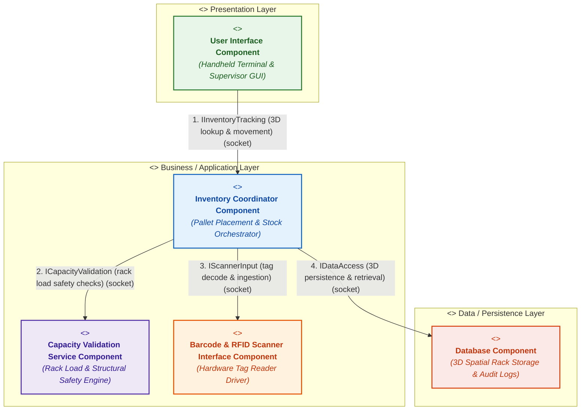

# Lab 3: Component Modelling & Architectural Pattern Selection

**Student Name:** Saatvik Gupta  
**SRN:** PES1UG24CS395  
**Section:** G  
**Course:** Software Engineering Laboratory  
**Problem Statement:** Problem Statement #27 — Warehouse Inventory & Pallet Location Tracker  
**Domain:** Smart Cities, Transport & Logistics  
**Primary Actors:** Warehouse Operator, Logistics Supervisor, RFID/Barcode Reader  

---

## Deliverables Summary
* [Lab 3 Submission PDF](Lab3_PES1UG24CS395_G.pdf) (Complete academic report with 1-page justification, tables, and checklist)
* [UML Component Diagram (High-Res PNG)](component_diagram.png)
* [UML Component Diagram (Vector PDF)](component_diagram.pdf)
* Detailed specification below with native Mermaid diagram and tables

---

## 1. Scenario Overview & Problem Context

The **Warehouse Inventory & Pallet Location Tracker** manages automated high-density warehouse facilities with over **100,000 pallet storage bins** structured across 3D multi-tier racking layouts (`Zone`, `Aisle`, `Rack`, `Shelf`).

### Core Functional Requirements
* **3D Pallet Localization**: Instantaneous 3D spatial lookup and mapping across 100,000 storage bins.
* **Structural Safety & Capacity Verification**: Automated rack load limit calculations, dimensional clearance verification, and structural overload prevention before pallet placement.
* **Industrial Hardware Scan Ingestion**: Real-time decoding and capture of EPC Gen2 passive RFID tags and GS1-128 barcodes from handheld imagers and portal gates.
* **Stock Movement & Supervisor Auditing**: Real-time coordinate updating, inventory transfers, and role-based supervisor override authorization for anomalous or heavy loads.
* **Spatial & Transactional Persistence**: Relational and spatial data persistence for rack layout, SKU catalog, bin occupancy, and regulatory traceability audit trails.

### Non-Functional Constraints & Quality Attributes
* **Performance (SLA)**: Real-time 3D pallet lookup and bin allocation queries in **under 100 milliseconds** across 100,000 bins to prevent forklift queue bottlenecks.
* **Hardware Modularity**: Decoupled reader drivers supporting multi-vendor handheld barcode scanners and fixed RFID portals.
* **Reliability & Edge Availability**: Fault-tolerant execution capable of continuous local operation on warehouse edge gateways/rugged terminals amidst metal-induced RF/WiFi dead zones.
* **Security & Access Control**: Multi-tier isolation and Role-Based Access Control (RBAC) preventing direct database tampering and enforcing authenticated supervisor overrides.

---

## 2. One-Page Written Architectural Justification

### Architecture Selection
> **"We chose Layered Architecture (3-Tier Layered Pattern) for the Warehouse Inventory & Pallet Location Tracker System."**

The system is organized into three distinct horizontal tiers:
1. **Presentation Layer**: Handheld rugged mobile terminals and supervisory desktop dashboard (`User Interface Component`).
2. **Business / Application Layer**: Core inventory tracking orchestration, structural rack load safety checks, and industrial scanner hardware decoding (`Inventory Coordinator Component`, `Capacity Validation Service Component`, `Barcode & RFID Scanner Interface Component`).
3. **Data / Persistence Layer**: 3D spatial coordinate indexing, bin occupancy, SKU catalog, and audit logs (`Database Component`).

---

### Two Scenario-Related Reasons for Selection

1. **Decoupling of Industrial Scanner Hardware Drivers from Core Business Logic**:  
   A high-throughput warehouse utilizes heterogeneous hardware readers—Bluetooth handheld laser imagers, vehicle-mounted forklift terminals, and fixed high-frequency portal RFID antennae. Adopting a Layered Architecture isolates hardware integration inside the `Barcode & RFID Scanner Interface Component`. Upgrading scanner firmware, reconfiguring RFID tag protocols (EPC Gen2), or changing scanner hardware manufacturers requires zero modifications to the inventory tracking workflows or rack allocation algorithms.

2. **High-Reliability Local Execution for Warehouse Edge Terminals**:  
   Unlike a distributed microservices architecture that depends on container orchestration, cloud service meshes, and continuous inter-service network availability, a layered architecture executes as a self-contained in-process engine on warehouse edge gateways or rugged mobile terminals. Large metal rack installations frequently create RF interference and intermittent WiFi dead zones. A layered architecture eliminates inter-component network failure modes, ensuring that operators can continue executing pallet moves and safety checks without network stalls.

---

### Security Advantage: Role Isolation & Inventory Data Protection

The Layered Architecture enforces strict horizontal access barriers:
* **Terminal-to-Database Decoupling**: Handheld terminals in the Presentation Layer have zero direct database connectivity. Warehouse operators cannot execute direct SQL queries, preventing SQL injection vulnerabilities and eliminating accidental or malicious alteration of pallet coordinates.
* **Role-Based Workflow Authorization**: All state transitions pass through the `Inventory Coordinator Component` in the Business Layer. The coordinator enforces role-based access rules—restricting normal operators to standard put-away/pick tasks while requiring cryptographically authenticated tokens from logistics supervisors for rack capacity overrides and inventory write-offs.

---

### Performance Benefit: Sub-100ms Pallet Lookup Across 100,000 Storage Bins

High-frequency warehouse operations require rapid pallet localization for forklift operators:
* **Zero Inter-Layer Network Serialization Overhead**: In a Layered Architecture, calls between the `User Interface`, `Inventory Coordinator`, `Capacity Validation Service`, and `Database` execute in-memory with sub-millisecond local latency (< 1 ms), compared to 50–150 ms per HTTP/gRPC hop in distributed microservice architectures.
* **Optimized Spatial Indexing Execution**: Direct in-process communication allows spatial indexing queries (e.g., R-Tree / B-Tree coordinate lookups across 100,000 bins) to complete in under 15 ms. This easily satisfies the strict **sub-100ms real-time lookup requirement**, preventing forklift idle times and maximizing logistics throughput.

---

## 3. Exactly 5 Required Components Breakdown

| Component Name | Architectural Layer | Stereotype | Detailed System Responsibility |
| :--- | :--- | :--- | :--- |
| **User Interface Component** | Presentation Layer | `<<component>>` | Provides handheld rugged mobile terminals and supervisory desktop dashboard GUIs. Displays real-time 3D warehouse layout maps, accepts manual and scan inputs, displays rack bin occupancy, highlights capacity alerts, and renders supervisor override controls. |
| **Inventory Coordinator Component** | Business Layer | `<<component>>` | Acts as the central business orchestrator for the warehouse. Coordinates pallet placement, retrieval, and internal relocation workflows; evaluates business constraints; coordinates scan ingestion; dispatches capacity validation checks; and manages database persistence. |
| **Capacity Validation Service Component** | Business Layer | `<<component>>` | Performs structural safety and rack capacity verification. Compares incoming pallet weight against structural beam limits, checks 3D physical dimensions (height, width, depth) against bin volume, and flags potential structural overloads to prevent rack collapse. |
| **Barcode & RFID Scanner Interface Component** | Business Layer | `<<component>>` | Encapsulates physical hardware reader drivers for handheld barcode scanners and automated portal RFID readers. Ingests raw scan pulses, decodes EPC Gen2 RFID tags and GS1 barcodes, performs sanitization, and transmits structured pallet IDs to the coordinator. |
| **Database Component** | Data Layer | `<<component>>` | Provides persistent spatial and relational data storage. Manages 3D coordinate mapping for 100,000 storage bins, active SKU inventory data, pallet weights, transaction histories, and immutable audit logs for regulatory compliance. |

---

## 4. Exactly 4 Required Interfaces Specification

| # | Interface Name | Connected Components | Provided (Ball) | Required (Socket) | Interaction Protocol & Data Flow |
| :-: | :--- | :--- | :--- | :--- | :--- |
| **1** | **`IInventoryTracking`** | User Interface <-> Inventory Coordinator | `Inventory Coordinator` | `User Interface` | **Pallet tracking and 3D bin lookup.** • UI requests pallet 3D coordinates (`lookupPallet(palletId)`). • UI initiates stock transfer (`movePallet(palletId, targetBinId)`). • Coordinator returns 3D coordinates, status, and movement validation results. |
| **2** | **`ICapacityValidation`** | Inventory Coordinator <-> Capacity Validation Service | `Capacity Validation Service` | `Inventory Coordinator` | **Rack capacity and safety verification.** • Coordinator sends verification request (`validateCapacity(binId, weight, dimensions)`). • Service computes rack structural stress and returns approval status (`APPROVED` or `OVERLOAD_WARNING`). |
| **3** | **`IScannerInput`** | Inventory Coordinator <-> Barcode & RFID Scanner Interface | `Barcode & RFID Scanner Interface` | `Inventory Coordinator` | **Hardware scan ingestion.** • Scanner interface captures raw laser/RFID signals, decodes payload, and fires callback (`onScanReceived(tagData, timestamp)`). • Coordinator validates pallet ID and triggers placement workflow. |
| **4** | **`IDataAccess`** | Inventory Coordinator <-> Database | `Database` | `Inventory Coordinator` | **Data persistence and 3D spatial retrieval.** • Coordinator queries 3D rack layout across 100,000 bins (`queryBinSpatialIndex(zone, aisle)`). • Coordinator commits inventory transactions and immutable audit records (`commitPalletMovement(moveRecord)`). |

---

## 5. UML Component Diagram

### High-Resolution Render

### Native Mermaid UML Component Representation

---

## 6. Architectural Pattern Comparative Trade-Off Analysis

| Architectural Pattern | Key Advantages (Pros) | Key Disadvantages (Cons) | Performance & Security Impact | Suitability for Warehouse Logistics |
| :--- | :--- | :--- | :--- | :--- |
| **Layered Architecture** *(Selected)* | • Clean separation of UI, business orchestration, and persistence. • Sub-millisecond in-process method latency. • Isolates scanner hardware drivers. • Reliable deployment on warehouse edge gateways. | • Strict layer traversal requires all requests to pass through business tier. • Tight horizontal coupling between adjacent layers. | • Sub-15ms 3D bin lookup easily satisfies <100ms SLA. • Direct database access barred from mobile terminals. • High local reliability during WiFi dead zones. | **Ideal Fit**: Optimal for localized, high-throughput warehouse logistics edge systems. |
| **Microservices Architecture** | • Independent deployment and isolated scaling of capacity validation and scan processing. • Polyglot technology stacks for separate services. | • High inter-service network latency and serialization overhead (HTTP/gRPC). • Vulnerable to warehouse WiFi drops between microservices. • Complex distributed transaction coordination across storage bins. | • Network roundtrips risk violating <100ms lookup SLA. • High resource footprint and management overhead on edge hardware. | **Poor Fit**: Overkill and high latency risk for edge warehouse operations. |
| **Event-Driven Architecture** | • Highly decoupled asynchronous messaging. • Excellent for handling high-volume burst events from portal RFID antennae. | • High broker infrastructure complexity (Kafka/RabbitMQ). • Asynchronous eventual consistency risks race conditions where two operators place pallets in the same bin. | • Eventual consistency causes physical bin collision hazards. • Harder to provide immediate sub-100ms synchronous confirmation to forklift operators. | **Sub-Optimal**: Better suited as a telemetry ingestion add-on than core bin coordinator. |

---

## 7. Deliverables Checklist & Compliance Verification

| Item | Task Sheet Requirement | Status | Verification Detail |
| :-: | :--- | :-: | :--- |
| **1** | Exactly 5 components are present | **Verified** | `User Interface`, `Inventory Coordinator`, `Capacity Validation Service`, `Barcode & RFID Scanner Interface`, `Database`. |
| **2** | Correct UML component notation is used | **Verified** | Standard rectangles with `<<component>>` stereotype, centered names, and UML 2.x tab glyph icons. |
| **3** | Exactly 4 required interfaces are shown | **Verified** | `IInventoryTracking`, `ICapacityValidation`, `IScannerInput`, `IDataAccess`. |
| **4** | Interface directions and labels are clear | **Verified** | Ball-and-socket connectors labeled with interaction protocol and semantics. |
| **5** | Provided/required interface notation used appropriately | **Verified** | Balls (lollipops) represent provided interfaces; sockets (cups) represent required interfaces. |
| **6** | Architecture choice is clearly justified | **Verified** | 3-Tier Layered Architecture formally selected with full rationale on page 1 of PDF. |
| **7** | Two scenario-related reasons provided | **Verified** | Scanner hardware driver modularity and edge terminal reliability in metal warehouse environments. |
| **8** | Security advantage explained | **Verified** | Role-based isolation preventing direct database access from mobile handheld terminals. |
| **9** | Performance benefit explained (<100ms) | **Verified** | In-memory inter-layer execution guarantees 3D bin lookup queries complete in <15ms. |
| **10** | Diagram exported as PNG and PDF | **Verified** | Available as `component_diagram.png` and `component_diagram.pdf`. |
| **11** | Justification saved as PDF | **Verified** | Saved as `Lab3_PES1UG24CS395_G.pdf` in `Lab_3/` and `documentos/`. |
| **12** | Submitted through GitHub repository | **Verified** | All files committed and pushed to remote GitHub repository. |
